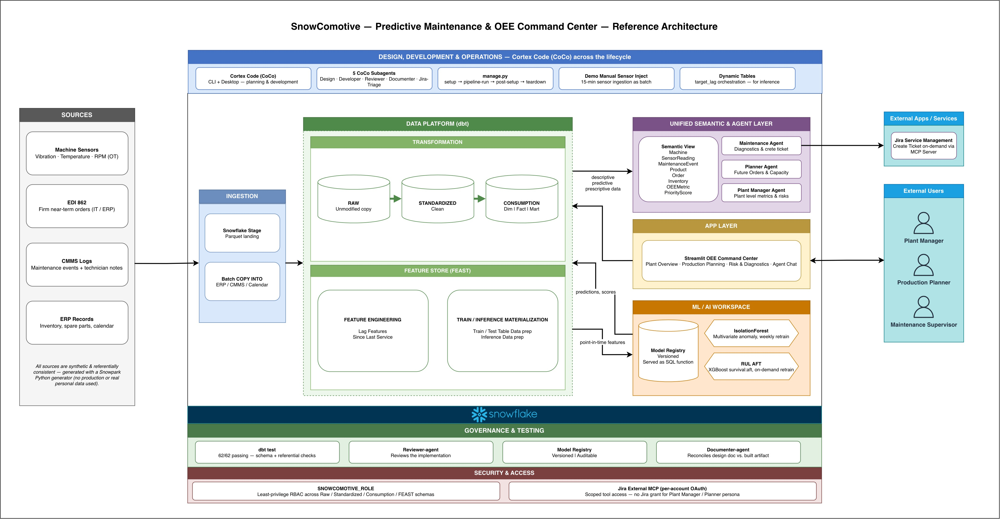
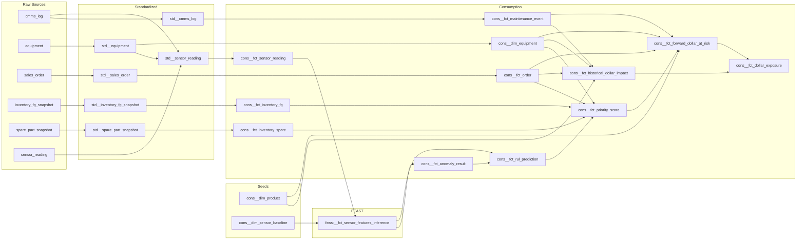

# SnowComotive — Predictive Maintenance & OEE Command Center

A predictive-maintenance and OEE command center for a discrete-manufacturing plant, built end-to-end on Snowflake with [Cortex Code (CoCo)](https://docs.snowflake.com/en/user-guide/cortex-code/cortex-code) — across planning, development, execution, and testing.

---

## What business problem does it solve?

Maintenance priority today is driven by failure risk or asset value alone — and that risk is usually spotted reactively, after symptoms appear, not predicted ahead of time.

This happens because failure signals (sensor data) and business context (demand, inventory, spare parts) live in disconnected systems owned by different teams.

Result: effort and capital go to the wrong machine at the wrong time — often too late to prevent the loss.

This solution predicts failures early and converges that risk with business context into one layer, so priority reflects real, forward-looking business impact — not just mechanical risk.

**Who it's for** — three personas share one semantic model, differentiated by tool access and framing, not three copies of the same dashboard:

| Persona | Primary need | What their agent can do |
|---|---|---|
| **Maintenance Supervisor** | Triage alerts, understand root cause, act immediately | Root-cause explanation, sensor drill-down, **creates a Jira ticket directly** — the only persona with Jira access |
| **Production Planner** | OEE trend/forecast, demand- and inventory-aware prioritization | Prioritization reasoning, forecast queries — **no ticketing tool** |
| **Plant Manager** | Plant-level rollup of OEE, risk, and $ impact | Read-only Q&A — **no ticketing tool** |

See [`docs/01-BRD.md`](docs/01-BRD.md) for the full business requirements.

---

## Architecture



Left to right: `Sources → Ingestion → Data Platform (dbt) ⇄ ML/AI Workspace → Unified Semantic & Agent Layer → App Layer → External Users / Apps`

- **Sources → Ingestion**: synthetic OT (sensors) + IT (ERP/CMMS/orders) data lands as Parquet on a Snowflake stage, then `COPY INTO`s into Raw tables.
- **Data Platform (dbt)**: Raw → Standardized → Consumption, plus a `FEAST` feature-engineering schema alongside Consumption.
- **Data Platform ⇄ ML/AI Workspace**: point-in-time features flow out to train/score two models (IsolationForest, RUL survival model); predictions flow back in as ordinary Consumption dynamic tables — there's no separate predictions datastore.
- **→ Semantic & Agent Layer**: descriptive (OEE), predictive (RUL/anomaly), and prescriptive (priority score) data converge into one semantic view behind three persona-scoped Cortex Agents.
- **→ App Layer**: a Streamlit "OEE Command Center" app — chart/table pages read Consumption directly, the chat panel is agent-mediated. Two read paths, same data.
- **→ External Apps**: ticket creation is a tool call owned by the agent layer — only the Maintenance Supervisor agent has it — landing in Jira Service Management via an External MCP Server. The App layer never touches it directly.

---

## Data lineage — the dollar-exposure chain

`cons__fct_dollar_exposure` is the pipeline's single leaf dynamic table — every other dynamic table's `target_lag` is `DOWNSTREAM` and cascades off this one leaf. It converges two independent chains: **predicted failure risk** (sensors → anomaly/RUL inference → priority score) and **business cost** (maintenance history + orders + inventory → dollar impact).



---

## Repository structure

| Path | What it is |
|---|---|
| [`predictive_maintenance_dbt/`](predictive_maintenance_dbt/) | dbt project — Raw → Standardized → Consumption → FEAST models, dynamic tables |
| [`oee_command_center_app/`](oee_command_center_app/) | Streamlit app (`streamlit_app.py` + `pages/`) — Plant Overview, Production Planning, Risk Diagnostics, Agent chat |
| [`scripts/`](scripts/) | Numbered SQL lifecycle scripts, run in order by `manage.py` (see [`scripts/README.md`](scripts/README.md)) |
| [`generator/`](generator/) | Synthetic data generator (Snowpark Python) — produces all Raw-table Parquet + live-tick demo files |
| [`manage.py`](manage.py) | Environment orchestrator CLI (`up` / `down` / `demo` / `post-setup`) |
| [`docs/`](docs/) | BRD → FRD → HLD → 11 LLD modules → Epics backlog → frozen per-story design docs → reference architecture diagram |
| [`.cortex/`](.cortex/) + [`.snowflake/cortex/`](.snowflake/cortex/) | CoCo skills, SDLC subagents, and the packaged `human-gated-sdlc-toolkit` plugin |

---

## Prerequisites & setup

1. **Python ≥ 3.11.**

2. **Install [`uv`](https://docs.astral.sh/uv/)** — this project uses `uv` exclusively for dependency management, never `pip` directly:

   ```bash
   curl -LsSf https://astral.sh/uv/install.sh | sh
   ```

3. **Install project dependencies with `uv sync`** (reads `pyproject.toml` / `uv.lock`, creates `.venv` automatically):

   ```bash
   uv sync
   ```

4. **Adding a new dependency later** — always `uv add <pkg>`, never `pip install`:

   ```bash
   uv add <pkg>
   ```

   Run every script as `uv run <script>` (e.g. `uv run python manage.py ...`) so it executes inside that same managed `.venv`.

5. **A Snowflake account**, with **two** connection profiles in `~/.snowflake/connections.toml`:

   ```toml
   # Bootstrap connection -- used by manage.py up/down. No role pinned, so it
   # can always connect even before snowcomotive_role exists or right after a teardown.
   [snow-co-cat-alyst]
   account = "<account-identifier>"
   user = "<your-username>"
   authenticator = "snowflake"
   password = "..."

   # Day-to-day ad hoc connection -- role pinned, only usable once the
   # environment has actually been set up.
   [snow-co-cat-alyst-snowcomotive]
   account = "<account-identifier>"
   user = "<your-username>"
   authenticator = "snowflake"
   password = "..."
   role = "snowcomotive_role"
   ```

   Requires the `secure-local-storage` extra on `snowflake-connector-python` (already in `pyproject.toml`) so the session token caches locally via `keyring`.

### Spin up the environment

```bash
SNOWFLAKE_CONNECTION_NAME=snow-co-cat-alyst uv run python manage.py up --target-lag "1 hour"
```

This generates the full synthetic dataset, loads Raw, runs the dbt pipeline (features → model training/evaluation → inference), deploys the semantic view + 3 Cortex Agents + Streamlit app. `--target-lag` sets the pipeline's single leaf dynamic table's refresh cadence (default `1 hour`).

### Drip-feed live data (demo)

```bash
SNOWFLAKE_CONNECTION_NAME=snow-co-cat-alyst uv run python manage.py demo inject-batch
```

Injects the next day's worth of sensor ticks into `RAW.SENSOR_READING`; the dynamic-table chain above picks it up automatically.

### Tear down

```bash
SNOWFLAKE_CONNECTION_NAME=snow-co-cat-alyst uv run python manage.py down
```

### One-time, standalone (not part of `up`)

```bash
uv run python manage.py setup-jira            # Jira SM auth plumbing (if using ticketing)
uv run python manage.py authorize-jira-mcp    # checks the Jira MCP connector; OAuth consent itself happens in Snowsight/CoWork UI
```

See [`AGENTS.md`](AGENTS.md) "Local dev environment" for the full rationale (why two connection profiles, why no `snow` CLI, why `manage.py` and not raw SQL scripts).

---

## Development workflow — SDLC + Jira

**Two separate Jira boards exist — don't conflate them:**

| | Board ID | Board type | Purpose |
|---|---|---|---|
| **Dev backlog** | `SH` | Kanban board | This repo's own dev backlog — stories/tasks/bugs. Source of truth is [`docs/05-Epics.md`](docs/05-Epics.md); this Jira board mirrors it. |
| **Live maintenance** | `SUP` | Jira Service Management | Real maintenance incidents, created at runtime by the deployed `maintenance_supervisor_agent` — the only persona-agent with Jira access — via a Jira MCP connector. Nothing to do with this repo's own development. |

Every story on the `SH` dev-backlog board moves through a **human-gated** loop of specialized CoCo subagents — no agent auto-chains to the next stage, every handoff below is a deliberate user action, and merges always require explicit user go-ahead:

```mermaid
flowchart LR
    SHBoard["SH board: pick story"] --> Triage["Jira-Triage-agent: create branch"]
    Triage --> Design["Design-agent: freeze design doc"]
    Design --> Dev["Developer-agent: implement"]
    Dev --> Review["Reviewer-agent: review + dbt test"]
    Review --> Doc["Documenter-agent: reconcile docs"]
    Doc --> Triage2["Jira-Triage-agent: commit, open PR, move SH story to Done"]

    Design -.->|"user confirms"| Dev
    Dev -.->|"user confirms"| Review
    Review -.->|"user confirms"| Doc
```



Packaged as a reusable, project-agnostic plugin — see [`.cortex/plugins/human-gated-sdlc-toolkit/SETUP.md`](.cortex/plugins/human-gated-sdlc-toolkit/SETUP.md) for the Jira cloudId/site/project-key fields a new project needs in its own `AGENTS.md`.

---

## Learn more

- [`docs/01-BRD.md`](docs/01-BRD.md) → [`docs/02-FRD.md`](docs/02-FRD.md) → [`docs/03-HLD.md`](docs/03-HLD.md) → [`docs/04-*-LLD.md`](docs/) — full requirements and design
- [`docs/05-Epics.md`](docs/05-Epics.md) — backlog (mirrors the `SH` Jira board)
