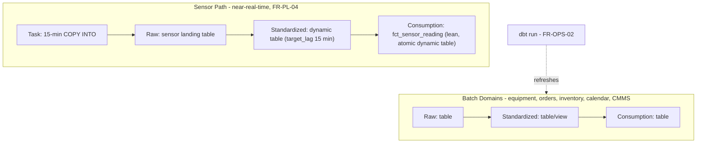
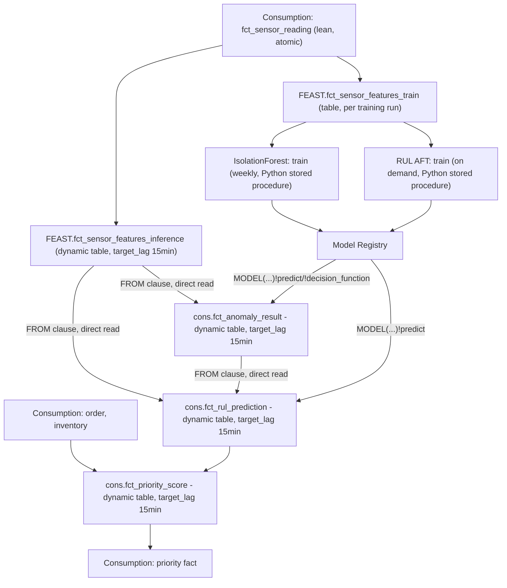
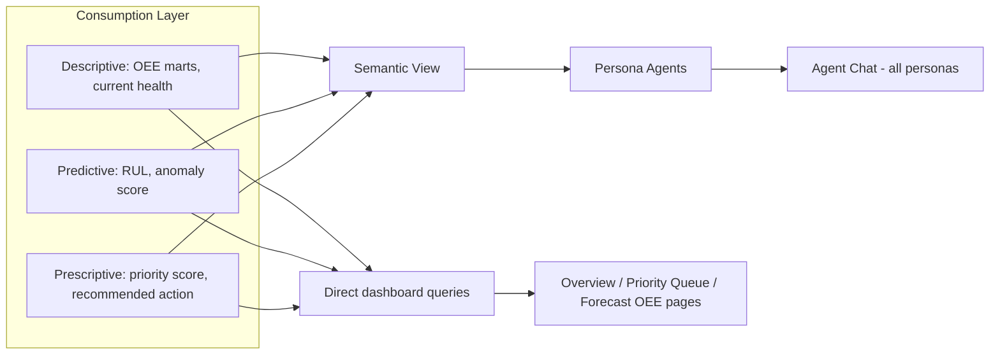
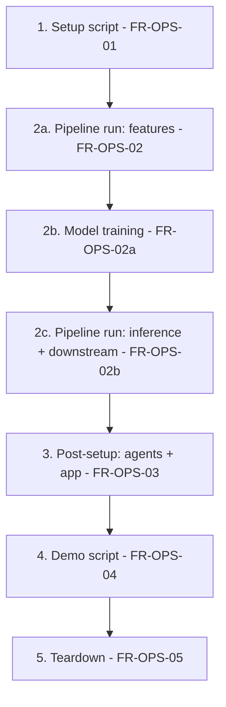

# High-Level Design (HLD)
## SnowComotive — Predictive Maintenance & Overall Equipment Effectiveness (OEE) Command Center

Status: Draft v0.1 — pending user validation
Traces to: [01-BRD.md](01-BRD.md), [02-FRD.md](02-FRD.md)

This HLD only adds what the FRD deferred: the architecture diagram, orchestration/scheduling, CoCo skill mapping, script sequencing, and concrete defaults for items the FRD left open. It does not restate FRD requirements — see FR-IDs for rationale.

---

## 1. Component Architecture

This is the structural view — components, their responsibilities, and the interfaces between them. Detailed step-by-step flows for each component are in Sections 1a–1c.

```mermaid
flowchart LR
    subgraph Sources [Source Systems]
        SrcData[Equipment, ERP, CMMS, Calendar - synthetic]
    end

    subgraph Ingestion [Ingestion and Storage]
        StageC[Snowflake Stage - Parquet]
    end

    subgraph Platform [Data Platform - dbt]
        Layers[Raw / Standardized / Consumption]
        FeatStoreC[FEAST - dbt feature schema]
    end

    subgraph MLPlatform [ML Platform]
        ModelsC[IsolationForest + RUL AFT]
        RegistryC[Model Registry]
    end

    subgraph SemanticLayer [Semantic and Agent Layer]
        SemViewC[Semantic View]
        AgentsC[3 Persona Agents]
    end

    subgraph AppLayer [Application Layer]
        StreamlitC[Command Center]
    end

    JiraC[Jira Service Management]

    Sources -->|synthetic Parquet files| Ingestion
    Ingestion -->|COPY INTO| Platform
    Platform -->|point-in-time features| MLPlatform
    MLPlatform -->|predictions, scores, versioned models| Platform
    Platform -->|descriptive, predictive, prescriptive data| SemanticLayer
    SemanticLayer -->|natural language, tool calls| AppLayer
    Platform -->|direct dashboard queries| AppLayer
    AgentsC -->|create/request ticket, on demand| JiraC
```



**Component responsibilities**, referencing FRD sections: Ingestion (B), Platform (C, D's `FEAST` schema — dbt-native, no external Feature Store SDK), ML Platform (D), Semantic Layer (E), Application Layer (F, G).

---

### 1a. Data Ingestion & Pre-processing



Sensor path: the Task's only job is `COPY INTO` on the Raw landing table (FR-PL-04). Everything downstream is dbt-materialized as a **dynamic table** (`materialized='dynamic_table'`, `target_lag='15 minutes'`) — no manually-created Dynamic Table object outside dbt. Batch domains use standard dbt materialization, refreshed only when the pipeline run step executes (FR-PL-04a) — not continuously, since they don't need it.

---

### 1b. Model Training & Inference



Only **training** is Python (Stored Procedure), invoked on its own schedule. **Inference has no separate trigger at all** — `cons.fct_anomaly_result` and `cons.fct_rul_prediction` are themselves dynamic tables whose `SELECT` calls the registered model directly (`MODEL(model_name, version)!predict(...)`) reading from `FEAST.fct_sensor_features_inference` (not the lean `cons.fct_sensor_reading` directly — that fact has no rolling windows/normalization, per Module 3); Snowflake's dynamic table engine re-scores only new rows automatically, driven by the same 15-minute sensor tick that ultimately refreshes both. This is Snowflake's documented "Continuous Model Inference with Dynamic Tables" pattern — no Task or stored procedure needed for inference, and no Raw/Standardized re-entry for model output (FR-PL-06, superseded). Feature engineering itself is reciprocated in dbt (`FEAST` schema, one macro, two materializations — LLD Module 4), not a separate Feature Store SDK. Two build-time requirements: both models must be logged with `volatility=IMMUTABLE` (FR-FS-00f), and the `FEAST` rolling-window macro's incremental-refresh behavior must be confirmed (FR-FS-09) — **confirmed at the FEAST layer 2026-08-30** (`insertedRows:1, copiedRows:0` on a single new tick, LLD Module 4 §3), though it required declaring `immutable_where` frozen regions on `std`/`cons` to work around their `ASOF JOIN`-forced `FULL` refresh mode — still open at the `cons.fct_anomaly_result`/`fct_rul_prediction` layer (not yet built); either layer failing forces a full rescore every refresh instead of an incremental one.

---

### 1c. Command Center Consumption Model



The Streamlit app has two read paths from Consumption: direct queries for charts/tables (fast, no agent involved), and agent-mediated natural language for the chat panel (FR-CC-05). Both read the same descriptive/predictive/prescriptive data — this three-tier framing (what happened / what will happen / what to do) maps directly onto Consumption's OEE marts, prediction marts, and priority mart respectively.

---

## 2. Orchestration & Scheduling

| Component | Trigger | Frequency | FR reference |
|---|---|---|---|
| Historical data generation | Manual (setup script) | Once per environment | FR-DG-12, FR-OPS-01 |
| Sensor tick ingestion (Task: COPY INTO Raw) | Snowflake Task | 15 min (or manual demo trigger) | FR-PL-04, FR-CC-06 |
| Sensor-path dynamic table refresh (Standardized, Consumption) | Automatic (target_lag), managed by dbt | 15 min | FR-PL-04, FR-PL-04a |
| `FEAST.FCT_SENSOR_FEATURES_INFERENCE` refresh (rolling windows + normalization) | Dynamic table, automatic — no Task | 15 min (with each tick) | FR-FS-01, FR-FS-09 |
| `FEAST.FCT_SENSOR_FEATURES_TRAIN` rebuild (frozen snapshot) | Manual / scheduled Task, part of FR-OPS-02a | Per training run | FR-FS-01 |
| dbt run — batch domains, phase 1: features (Raw → Standardized → Consumption) | Manual / scheduled Task | Per pipeline run step | FR-OPS-02, FR-PL-04a |
| Model training (IsolationForest + RUL AFT) | Manual / scheduled Task | Between pipeline phases | FR-OPS-02a |
| dbt run — phase 2: inference dynamic tables + downstream | Manual / scheduled Task | Per pipeline run step, after FR-OPS-02a | FR-OPS-02b |
| IsolationForest training | Snowflake Task (Python stored procedure) | Weekly | FR-FS-00a |
| IsolationForest inference (`cons.fct_anomaly_result`) | Dynamic table, automatic — no Task | 15 min (with each tick); initial historical backfill on creation | FR-FS-00b, FR-FS-00e |
| RUL AFT training | Manual / scheduled Task (Python stored procedure) | On demand (re-train as data grows) | FR-FS-02, FR-FS-03 |
| RUL AFT inference (`cons.fct_rul_prediction`) | Dynamic table, automatic — no Task | 15 min (with each tick) | FR-FS-02, FR-FS-07 |
| Priority score (`cons.fct_priority_score`) | Dynamic table, automatic — no Task | 15 min (with each tick), created during FR-OPS-02b | FR-FS-08 |
| Agent ticket creation | User-initiated (chat) | On demand only | FR-JR-03 |

---

## 3. CoCo Skill Mapping

| HLD Component | Primary CoCo Skill |
|---|---|
| Data generation script | `snowpark-python` |
| Stage upload, Raw load | `snowpark-python`, `sql-author` |
| dbt pipeline (Raw/Standardized/Consumption) | `dbt-projects-on-snowflake` |
| `FEAST` feature engineering (macro + train/inference tables) | `dbt-projects-on-snowflake` |
| Sensor-path dynamic table materialization | `dbt-projects-on-snowflake`, `dynamic-tables` |
| IsolationForest + RUL AFT training | `machine-learning` |
| IsolationForest + RUL AFT inference (dynamic tables calling `MODEL(...)!predict`) | `dbt-projects-on-snowflake`, `dynamic-tables`, `machine-learning` |
| Semantic view + 3 Cortex Agents | `agent-studio` |
| Streamlit Command Center | `developing-with-streamlit-in-snowflake` |
| Jira ticket tool (agent-created) | `integrations`, `notification` |
| Environment scripts (setup/pipeline/post-setup/demo/teardown) | `snowflake-tasks`, `warehouse` |
| 4 SDLC agents (Design/Developer/Reviewer/Documenter — dbt model development only) | Custom skills — new, authored for this project |
| Synthetic data generator | `snowpark-python` (bundled) for now — a generalized, standalone reusable skill is deferred to future work, not built for this submission |

---

## 4. Script Sequencing (Section I)



The pipeline run step is genuinely two dbt passes with model training in between (FR-OPS-02/02a/02b) — the inference dynamic tables reference the trained models by name at creation time, so training can't happen after they're built.

Each script is independently re-runnable (FR-OPS-06). Setup only touches the Jira Service Management project (A5); the Kanban project (A10) is created once, outside this sequence, at project inception.

---

## 5. Concrete Defaults for Previously Open Items

**Priority score formula** (FR-FS-08), weighted 0-100, transparently documented as an MVP placeholder (BRD §8 V2 = Monte Carlo/optimization):

```
priority_score = 0.40 * rul_urgency        -- normalized inverse of predicted RUL hours
               + 0.25 * demand_pressure     -- firm near-term order volume, next 2-4 weeks, normalized
               + 0.20 * inventory_buffer    -- inverse of days-of-supply, normalized
               + 0.15 * spare_part_readiness -- binary/lead-time modifier
```

**Semantic view entities** (FR-SA-01): `Machine`, `SensorReading` (lean atomic fact, `cons.fct_sensor_reading` — raw value + operational-context joins only, real physical units), `MaintenanceEvent`, `Product` (backed by `cons.dim_product`), `Order`, `Inventory`, `OEEMetric`, `PriorityScore`. Relationships: `Machine` 1:N `SensorReading`/`MaintenanceEvent`; `Machine` N:1 `Product` (via routing); `Product` 1:N `Order`/`Inventory`. Rolling windows/normalization (`FEAST` schema) are training/inference-only — the semantic view and dashboard never see them, only the real-unit atomic fact.

**Streamlit pages** (FR-CC-01 to 07): Overview (health + OEE), Priority Queue, Forecast OEE, Agent Chat (persona-scoped), Impact Statement. Persona switcher is a sidebar control, not a separate page.

**Agent tools by persona** (FR-SA-02) — real Cortex Agent tool types, see LLD Module 7 for full `tool_spec`/`tool_resources`:
- Supervisor: `Analyst` (`cortex_analyst_text_to_sql`), `explain_prediction` (`generic`, FR-FS-00d, pending validation), `create_jira_ticket` (`generic`)
- Planner: `Analyst`, `explain_prediction`, `request_jira_ticket` (same underlying stored procedure as `create_jira_ticket`, escalation framing via orchestration instructions)
- Plant Manager: `Analyst` only

**Jira ticket fields** (FR-JR-01): `machine_id`, `predicted_rul_hours`, `priority_score`, `root_cause_summary`, `requested_by_persona`.

**IsolationForest retrain cadence**: weekly, Sunday 02:00, on trailing 3-year window (rolling).

---

## 6. Resolved by LLD

All items originally deferred here are now specified in LLD Modules 1-11 ([04-0-LLD.md](04-0-LLD.md)): table/column DDL (Module 1), semantic view mapping (Module 6, deliberately light), agent tool schemas (Module 7), IsolationForest hyperparameters/normalization (Modules 4/5), Streamlit layout (Module 8), Jira auth (Module 9), SDLC skill scope (Module 11). The one genuinely outstanding item is **model explainability test results** (FR-FS-00c) — the plan exists (Module 5 §4) but hasn't been run against real data yet; still pending before `explain_prediction` is finalized.
